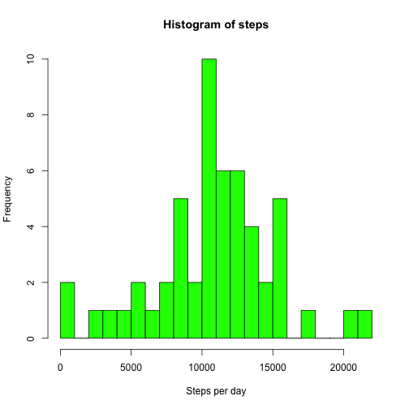
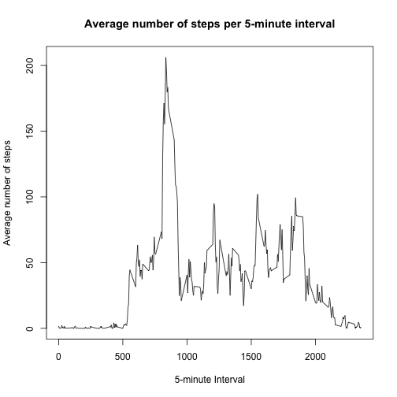
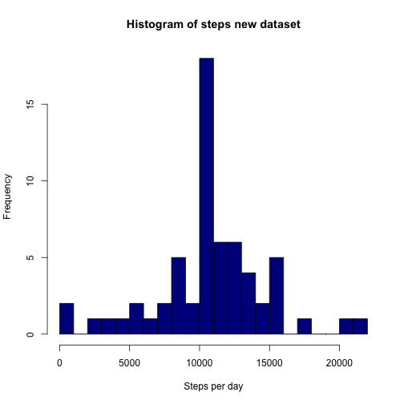
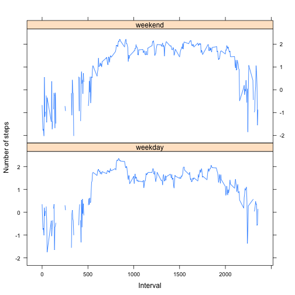

Reproducible Research: Peer Assessment 1
============================================

## Loading and preprocessing the data
1. Load the data

```r
data <- read.csv("activity.csv", header = TRUE, sep = ",")
```

2.Transform the variable date from the class factor into class date

```r
data$date <- as.Date(as.factor(data$date), format = "%Y-%m-%d")
```


## What is mean total number of steps taken per day?
1. Histogram of the total number of steps taken each day

```r
noNAs <- data[!is.na(data$steps),]
library(dplyr)
noNAs <- tbl_df(noNAs)
stepsPerDay  <- noNAs %>% group_by(date) %>% summarize(nrSteps <- sum(steps))
hist(stepsPerDay$nrSteps, breaks = 30, col="green", main = "Histogram of steps", xlab = "Steps per day")
```

 

2. Mean and median total number of steps taken per day

```r
tapply(noNAs$steps, noNAs$date, mean)
```

```
## 2012-10-02 2012-10-03 2012-10-04 2012-10-05 2012-10-06 2012-10-07 
##  0.4375000 39.4166667 42.0694444 46.1597222 53.5416667 38.2465278 
## 2012-10-09 2012-10-10 2012-10-11 2012-10-12 2012-10-13 2012-10-14 
## 44.4826389 34.3750000 35.7777778 60.3541667 43.1458333 52.4236111 
## 2012-10-15 2012-10-16 2012-10-17 2012-10-18 2012-10-19 2012-10-20 
## 35.2048611 52.3750000 46.7083333 34.9166667 41.0729167 36.0937500 
## 2012-10-21 2012-10-22 2012-10-23 2012-10-24 2012-10-25 2012-10-26 
## 30.6284722 46.7361111 30.9652778 29.0104167  8.6527778 23.5347222 
## 2012-10-27 2012-10-28 2012-10-29 2012-10-30 2012-10-31 2012-11-02 
## 35.1354167 39.7847222 17.4236111 34.0937500 53.5208333 36.8055556 
## 2012-11-03 2012-11-05 2012-11-06 2012-11-07 2012-11-08 2012-11-11 
## 36.7048611 36.2465278 28.9375000 44.7326389 11.1770833 43.7777778 
## 2012-11-12 2012-11-13 2012-11-15 2012-11-16 2012-11-17 2012-11-18 
## 37.3784722 25.4722222  0.1423611 18.8923611 49.7881944 52.4652778 
## 2012-11-19 2012-11-20 2012-11-21 2012-11-22 2012-11-23 2012-11-24 
## 30.6979167 15.5277778 44.3993056 70.9270833 73.5902778 50.2708333 
## 2012-11-25 2012-11-26 2012-11-27 2012-11-28 2012-11-29 
## 41.0902778 38.7569444 47.3819444 35.3576389 24.4687500
```

```r
tapply(noNAs$steps, noNAs$date, median)
```

```
## 2012-10-02 2012-10-03 2012-10-04 2012-10-05 2012-10-06 2012-10-07 
##          0          0          0          0          0          0 
## 2012-10-09 2012-10-10 2012-10-11 2012-10-12 2012-10-13 2012-10-14 
##          0          0          0          0          0          0 
## 2012-10-15 2012-10-16 2012-10-17 2012-10-18 2012-10-19 2012-10-20 
##          0          0          0          0          0          0 
## 2012-10-21 2012-10-22 2012-10-23 2012-10-24 2012-10-25 2012-10-26 
##          0          0          0          0          0          0 
## 2012-10-27 2012-10-28 2012-10-29 2012-10-30 2012-10-31 2012-11-02 
##          0          0          0          0          0          0 
## 2012-11-03 2012-11-05 2012-11-06 2012-11-07 2012-11-08 2012-11-11 
##          0          0          0          0          0          0 
## 2012-11-12 2012-11-13 2012-11-15 2012-11-16 2012-11-17 2012-11-18 
##          0          0          0          0          0          0 
## 2012-11-19 2012-11-20 2012-11-21 2012-11-22 2012-11-23 2012-11-24 
##          0          0          0          0          0          0 
## 2012-11-25 2012-11-26 2012-11-27 2012-11-28 2012-11-29 
##          0          0          0          0          0
```

## What is the average daily activity pattern?
1. Time series plot of the 5-minute interval (x-axis) and the average number of steps taken, averaged across all days (y-axis)

```r
avgInterval <- noNAs %>% group_by(interval) %>% summarize(avgSteps <- mean(steps))
plot(avgInterval$interval, avgInterval$avgSteps, type="l", xlab = "5-minute Interval", ylab = "Average number of steps", main="Average number of steps per 5-minute interval")
```

 

2. Which 5-minute interval, on average across all the days in the dataset, contains the maximum number of steps?

```r
avgInterval[which.max(avgInterval$avgSteps), "interval"]
```

```
## Source: local data frame [1 x 1]
## 
##   interval
##      (int)
## 1      835
```

## Imputing missing values
1. Calculate and report the total number of missing values in the dataset (i.e. the total number of rows with NAs)
- number of NAs for "interval"

```r
sum(is.na(data$interval))
```

```
## [1] 0
```
- number of NAs for "date"

```r
sum(is.na(data$date))
```

```
## [1] 0
```
- number of NAs for "steps"

```r
sum(is.na(data$steps))
```

```
## [1] 2304
```

2. Devise a strategy for filling in all of the missing values in the dataset
To fill in the missing values of the variable "steps", 
I propose to take the mean of the steps for the respective 5-minutes interval, accross all days.
Once one NA is filled out, it becomes valid information for the subsequent calculations.

3. Create a new dataset that is equal to the original dataset but with the missing data filled in.

```r
dataNew <- data
for (i in 1:nrow(dataNew)){
        if (is.na(dataNew[i,"steps"])){
                sub <- subset(dataNew, dataNew$interval==dataNew[i, "interval"])
                dataNew[i, "steps"] <- mean(sub$steps, na.rm = TRUE)
        }
}
head(dataNew)
```

```
##       steps       date interval
## 1 1.7169811 2012-10-01        0
## 2 0.3396226 2012-10-01        5
## 3 0.1320755 2012-10-01       10
## 4 0.1509434 2012-10-01       15
## 5 0.0754717 2012-10-01       20
## 6 2.0943396 2012-10-01       25
```

4. Make a histogram of the total number of steps taken each day and Calculate and report the mean and median total number of steps taken per day. Do these values differ from the estimates from the first part of the assignment? What is the impact of imputing missing data on the estimates of the total daily number of steps?

```r
dataNew <- tbl_df(dataNew)
stepsPerDayNew  <- dataNew %>% group_by(date) %>% summarize(nrStepsNew <- sum(steps), meanSteps <- mean(steps), medianSteps <- median(steps))
hist(stepsPerDayNew$nrStepsNew, breaks = 30, col="darkblue", main = "Histogram of steps new dataset", xlab = "Steps per day")
```

 

```r
stepsPerDayNew$meanSteps
```

```
##  [1] 37.3825996  0.4375000 39.4166667 42.0694444 46.1597222 53.5416667
##  [7] 38.2465278 37.3825996 44.4826389 34.3750000 35.7777778 60.3541667
## [13] 43.1458333 52.4236111 35.2048611 52.3750000 46.7083333 34.9166667
## [19] 41.0729167 36.0937500 30.6284722 46.7361111 30.9652778 29.0104167
## [25]  8.6527778 23.5347222 35.1354167 39.7847222 17.4236111 34.0937500
## [31] 53.5208333 37.3825996 36.8055556 36.7048611 37.3825996 36.2465278
## [37] 28.9375000 44.7326389 11.1770833 37.3825996 37.3825996 43.7777778
## [43] 37.3784722 25.4722222 37.3825996  0.1423611 18.8923611 49.7881944
## [49] 52.4652778 30.6979167 15.5277778 44.3993056 70.9270833 73.5902778
## [55] 50.2708333 41.0902778 38.7569444 47.3819444 35.3576389 24.4687500
## [61] 37.3825996
```

```r
stepsPerDayNew$medianSteps
```

```
##  [1] 34.11321  0.00000  0.00000  0.00000  0.00000  0.00000  0.00000
##  [8] 34.11321  0.00000  0.00000  0.00000  0.00000  0.00000  0.00000
## [15]  0.00000  0.00000  0.00000  0.00000  0.00000  0.00000  0.00000
## [22]  0.00000  0.00000  0.00000  0.00000  0.00000  0.00000  0.00000
## [29]  0.00000  0.00000  0.00000 34.11321  0.00000  0.00000 34.11321
## [36]  0.00000  0.00000  0.00000  0.00000 34.11321 34.11321  0.00000
## [43]  0.00000  0.00000 34.11321  0.00000  0.00000  0.00000  0.00000
## [50]  0.00000  0.00000  0.00000  0.00000  0.00000  0.00000  0.00000
## [57]  0.00000  0.00000  0.00000  0.00000 34.11321
```
By replacing NAs according to the above-described strategy, the histogram has changed accordingly.
Moreover, the mean total number of steps taken per day has changed for those days were we previously had NAs.
In addition, we now have information for all days (i.e. 61 days - ```{r, echo=TRUE} length(stepsPerDayNew$meanSteps)```, as compared to 53 days - ```{r, echo=TRUE} length(tapply(noNAs$steps, noNAs$date, mean))```)
The median total number of steps taken per day has changed in a few cases (whereas now we have complete information, in most of the days the median is still zero)

## Are there differences in activity patterns between weekdays and weekends?
1. Create a new factor variable in the dataset with two levels -- "weekday" and "weekend" indicating whether a given date is a weekday or weekend day.

```r
dataNew$Day <- as.factor(weekdays(dataNew$date))
wday <- function(day) {
        if (day %in% c("Saturday", "Sunday")) { "weekend"
        }else{ "weekday"}
}
dataNew$Day <- sapply(dataNew$Day, wday)
table(dataNew$Day)
```

```
## 
## weekday weekend 
##   12960    4608
```

2. Panel plot of the 5-minute interval (x-axis) and the average number of steps taken, averaged across all weekday days or weekend days (y-axis).

```r
library(lattice)
W <- dataNew %>% group_by(Day, interval) %>% summarize(st <- mean(steps))
xyplot(log10(W$st) ~ W$interval | W$Day, W, layout=c(1,2), type="l", xlab="Interval", ylab="Number of steps")
```

 

